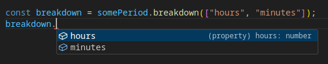
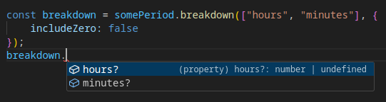

# Chrono

Easy, lightweight time library.

Chrono, with its unoriginal but fittingly straightforward name, provides two classes: `TimePeriod`, which represents a length of time, and `TimePoint`, which represents a specific point in time.

## `TimePeriod`

There are many ways to create a `TimePeriod`:

```ts
const oneWeek = new TimePeriod({weeks: 1});
const oneWeek = new TimePeriod({days: 7});
const oneWeek = new TimePeriod({days: 6, hours: 24});
const oneWeek = TimePeriod.weeks(1);
const oneWeek = TimePeriod.days(7);
const oneWeek = TimePeriod.days(6).add({hours: 24});
const oneWeek = TimePeriod.days(6).add(TimePeriod.days(1));
const oneWeek = TimePeriod.days(8).subtract({days: 1});
const oneWeek = TimePeriod.days(1).multiply(7);
// and so on

const somePeriod = new TimePeriod({
    days: 11,
    hours: 10.5
});
```

And as many ways to read one:

```ts
const weeks = oneWeek.asWeeks; // 1
const days = oneWeek.asDays; // 7
const hours = oneWeek.asHours; // 168
// asMinutes, asSeconds, asMilliseconds

const breakdown = somePeriod.breakdown(); // { days: 11, hours: 10, minutes: 30 }
```

### More on `breakdown()`

This method breaks a `TimePeriod` down into meaningful units:

```ts
// specify units:
const breakdown = somePeriod.breakdown(["days", "hours"]);
// ^ { days: 11, hours: 10 }

// retain precision by giving the final unit as float:
const breakdown = somePeriod.breakdown(["days", "hours"], {
    floatLast: true
}); // { days: 11, hours: 10.5 }

// omit units with value 0
const breakdown = TimePeriod.hours(26).breakdown(["days", "hours", "minutes"], {
    includeZero: false,
}); // { days: 1, hours: 2 }

// without specifying units:
const breakdown = somePeriod.breakdown();
const breakdown = somePeriod.breakdown({ includeZero: true });
```

`breakdown()`'s return type depends on specified units and `includeZero` option. With zeros included, its type is `{ [unit]: number }` and with zeros omitted it's `{ [unit]?: number | undefined }`.





When units are not specified, `floatLast` defaults to true and `includeZero` defaults to false and the units days, hours, minutes, seconds and milliseconds are used. When units are specified, `floatLast` defaults to false and `includeZero` defaults to true. The rationale is that the former case, with unspecified units, will therefore provide units as required, without loss of information, while specifiying units should by default yield a specific, predictable structure.

The order in which units are given is inconsequential. More significant units will be exhausted first. That is, `t.breakdown(["seconds", "minutes"])` will produce the same result as `t.breakdown(["minutes", "seconds"])`.

`TimePeriod` serialises into JSON as an object that can be converted back with `new TimePeriod(unserialisedValue)`.

## `TimePoint`

There are many ways to create a `TimePoint`:

```ts
// now:
const now = TimePoint.now();
// Date object:
const point = new TimePoint(new Date());
// epoch milliseconds:
const point = new TimePoint(jsDate.getTime());
// epoch TimePeriod:
const point = new TimePoint(TimePeriod.weeks(2652));
// or
const point = TimePoint.epochStart.add({weeks: 2652});
// string:
const point = new TimePoint("2020-10-31 17:30 GMT");
// descriptor object:
const point = new TimePoint({
    year: 2022,
    month: 10,
    day: 31,
    hour: 17,
    minute: 30,
    second: 0,
    timezone: "GMT"
});
// epoch breakdown:
const point = new TimePoint({
    unixEpoch: someTimePeriod.breakdown()
});
```

A TimePoint can be read as a JS `Date` via `timepoint.asDate` or as a unix epoch `TimePeriod` via `timepoint.unixEpoch`.

```ts
console.log("Time passed since 1970-01-01 GMT:", TimePoint.now().unixEpoch.breakdown());
// at time of writing: { days: 19961, hours: 21, minutes: 16, seconds: 44, milliseconds: 228 }
```

`timepoint.add(...period)` accepts a mix of `TimePeriod` and breakdown-like objects and adds the combined total to create a new `TimePoint`, leaving the original unchanged:
```ts
const nextWeek = TimePoint.now().add(
    TimePeriod.days(6),
    { hours: 24 }
);

const thirtySecondsLater = point.add({ minutes: .5 });
```

`timepoint.subtract(period)` accepts a single value of either of those types.
```ts
const lastWeek = TimePoint.now().subtract({weeks: 1});
const lastWeek = TimePoint.now().subtract(TimePeriod.weeks(1));
```

Use `tp.isBefore()`, `tp.isAfter()` and `tp.equals()` to compare with other points in time, each accepting a `TimePoint | Date` value.

Use `tp.difference(TimePoint | Date)` to determine the period between two times, as a `TimePeriod`.
```ts
const point = new TimePoint("2020-10-31 17:30 GMT");
const elapsed = point.difference(TimePoint.now());
log(elapsed.breakdown());
// at time of writing: { days: 1395, hours: 5, minutes: 8, seconds: 37, milliseconds: 203 }
```

`TimePoint` serialises into JSON as `{ unixEpoch: tp.breakdown() }` for easy conversion back with, for example, `new TimePoint(unserialisedValue)`. Casting to string gives the same result as casting an equivalent `Date`, to ease integration.

## `wait()` & `atTime()`

`wait()` takes either a time period or a point in time and returns a Promise that will be resolved when the specified time has elapsed. This can be used as a `TimePeriod`-compatible equivalent to `setTimeout()` but with the flexibility of a Promise.

```ts
// wait for a period
wait({minutes: 1, seconds: 30}).then(() => alert("time up"));
await wait(oneWeek);
// numbers are interpreted as milliseconds
await wait(10000);

// wait for a specific time
await wait(new Date("2094-11-16"));
await wait(new TimePoint("2094-11-16"));
```

`atTime()` takes a point in time, either as a `Date` or a `TimePoint`, and a callback to run at the given time.

```ts
atTime(appointmentTime.subtract({minutes: 15}), () => alert("upcoming appointment"));
atTime(new TimePoint("2099-11-06"), () => releaseHalfLife3());
```